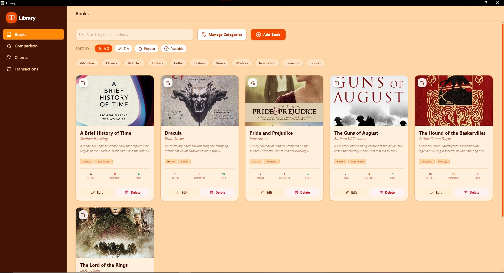
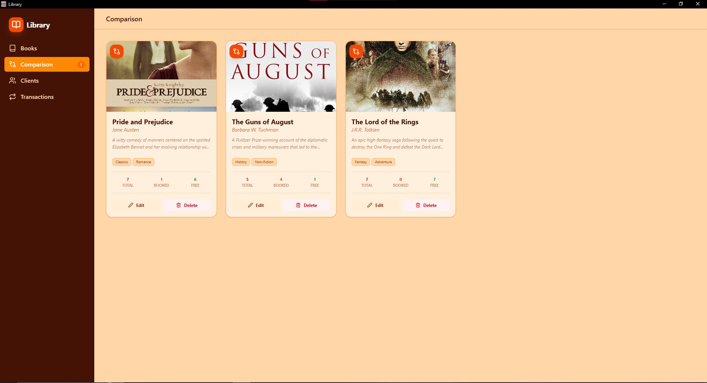
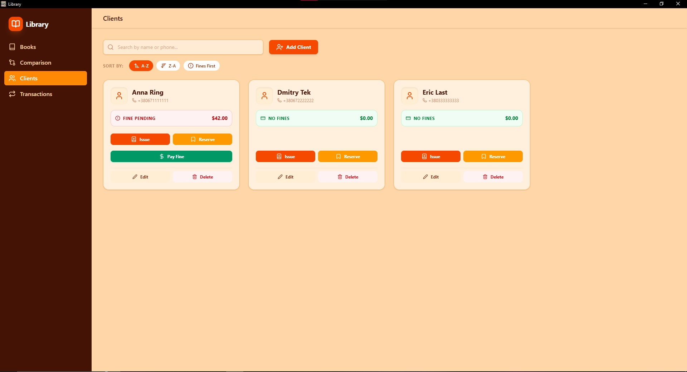
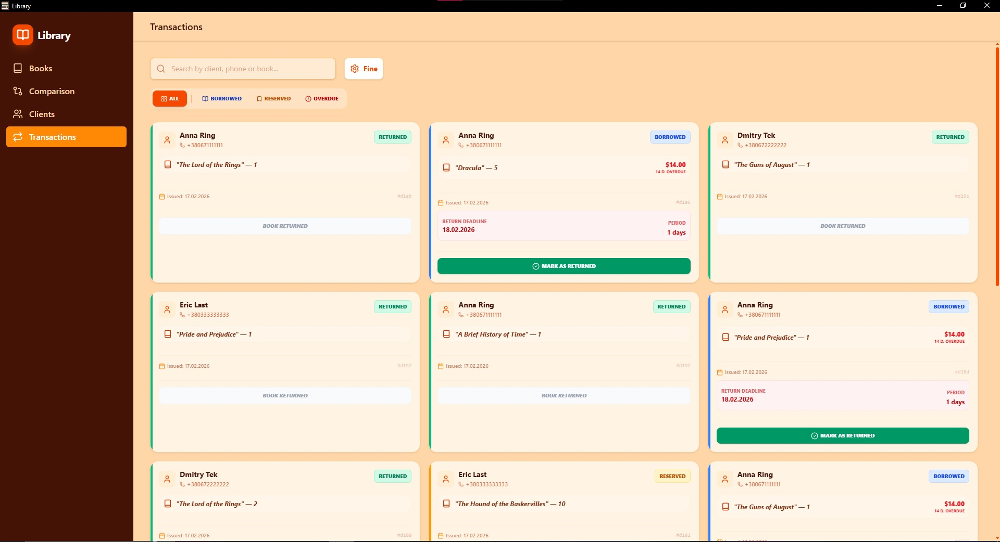

# Fullstack Library

A comprehensive desktop application for library automation: from book inventory management to tracking client transactions.

---

## Tech Stack

- **Frontend:** React 19, Tailwind CSS
- **Desktop Wrapper:** Electron (Portable EXE)
- **Backend:** Node.js, Express
- **Database:** MongoDB Atlas (Cloud)
- **Tools:** Vite, Mongoose, Concurrently

## Key Features

- **Book Inventory:** Advanced management of the library fund with search and categorization.
- **Selection & Editing:** Interactive tool to select specific books for batch editing or detailed review.
- **Client Database:** Centralized storage of reader information and membership details.
- **Transaction Tracking:** Real-time logging of book issuance, returns, and history.
- **Desktop Integration:** Fully functional portable Windows application with automatic background server launch.

## Interface Screenshots

### Library Management

<p align="center">
  
  
  <br>
  <em>Main Book Catalog and Selection/Edit Interface</em>
</p>

### Clients & Logs

<p align="center">
  
  
  <br>
  <em>Customer Database and Transaction History Logs</em>
</p>

## Installation & Development

To run this project in development mode:

1. **Clone the repository:**
   ```bash
   git clone https://github.com/SherryBlood/fullstack-library-app.git
   ```
2. **Install dependencies:**
   - Install all necessary packages for both Frontend and Backend:

   ```npm install

   ```

3. **Database Configuration:**
   - Open backend/server.js.
   - Replace the mongoURI string with your own MongoDB connection string.
4. **Run the Application:**
   - To launch the project with hot-reload for both Vite and Electron:

   ```npm start

   ```

5. **Building the Portable EXE:**
   - To package the application into a single standalone file:

   ```npm run dist

   ```
